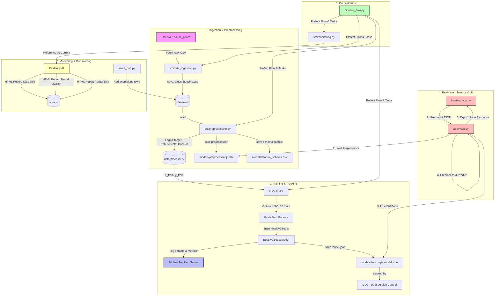

# 🏡 Ames Housing Price Prediction: End-to-End MLOps System Report

This comprehensive report details the architecture, design choices, technologies, and machine learning techniques implemented in the **Ames Housing MLOps Project**. 

The system transitions an experimental Jupyter Notebook (`ames-house-prediction.ipynb`) into a production-grade, modular, automated, and observable machine learning pipeline. It implements best practices across Software Engineering, DevOps, and MLOps to deliver a robust, scalable, and self-monitoring house price forecasting system.

---

## 1. System Architecture & Data Flow

Below is the high-level architecture showing how data, model artifacts, metadata, and web requests flow through the entire system.



---

## 2. Directory & File Hierarchy Breakdown

The project structure is highly modularized, ensuring separation of concerns (configuration, source code, data, model artifacts, APIs, frontend UI, monitoring, and pipeline orchestration).

```directory
ames_housing_mlops/
├── .dvc/                     # Data Version Control internal configurations
├── .git/                     # Git repository version history files
├── .vscode/                  # Editor workspace settings (auto-activates venv)
│   └── settings.json
├── app/                      # Backend serving layer
│   └── main.py               # FastAPI application with prediction endpoint
├── data/                     # Versioned data stores (ignored in Git, tracked by DVC)
│   ├── processed/            # Preprocessed train/test Parquet files
│   └── raw/                  # Downloaded raw CSV file
├── frontend/                 # Client UI layer
│   └── app.py                # Streamlit dashboard and calculator UI
├── mlruns/                   # MLflow experiment tracking database (local files)
├── models/                   # Saved serialization weights and schemas
│   ├── best_xgb_model.json   # High-speed serialized XGBoost model structure
│   ├── best_xgb_model.json.dvc # DVC pointer tracking the XGBoost model binary
│   ├── feature_schema.csv    # Small sample schema to infer slider limits/defaults
│   └── preprocessor.joblib   # Serialized Scikit-learn column transformer
├── reports/                  # Interactive HTML monitoring reports (Evidently AI)
├── src/                      # Source modules (runnable as isolated scripts)
│   ├── config.py             # Global constants, directory creators, and target name
│   ├── data_ingestion.py     # Pulls raw datasets from OpenML
│   ├── monitoring.py         # evidently AI suite for drift & model decay metrics
│   ├── preprocessing.py      # Cleans numerical/categorical features & splits
│   └── train.py              # XGBoost training + Optuna HPO + MLflow logs
├── .dvcignore                # Exclusions for Data Version Control
├── .gitignore                # Exclusions for Git (prevents large files from upload)
├── ames-house-prediction.ipynb # Legacy experimental notebook
├── inject_drift.py           # Simulation helper to append anomalies & test monitoring
├── pipeline_flow.py          # Prefect Pipeline orchestration runner
├── pyrightconfig.json        # Static type-checking configuration
├── requirements.txt          # Explicit list of Python dependencies
├── run_pipeline.py           # Standard sequental pipeline runner script (no Prefect dependency)
└── venv/                     # Python virtual environment folder (local libraries)
```

### File-by-File Explanations

| File / Folder Path | Type | Primary Purpose |
| :--- | :--- | :--- |
| [src/config.py](file:///c:/Users/risin/Documents/ames_housing_mlops/src/config.py) | Python Script | Establishes base paths (`BASE_DIR`, `DATA_DIR`, `MODEL_DIR`), automatically creates directories upon import, and sets core variables (e.g., target name `SalePrice`). |
| [src/data_ingestion.py](file:///c:/Users/risin/Documents/ames_housing_mlops/src/data_ingestion.py) | Python Script | Fetches the standard `house_prices` dataset from OpenML via Scikit-Learn's API and saves it directly to `data/raw/ames_housing.csv`. |
| [src/preprocessing.py](file:///c:/Users/risin/Documents/ames_housing_mlops/src/preprocessing.py) | Python Script | Separates variables into numerical and categorical sub-pipelines. Handles median imputation, robust scaling, missing value fills, and one-hot encoding. Saves datasets as parquet. |
| [src/train.py](file:///c:/Users/risin/Documents/ames_housing_mlops/src/train.py) | Python Script | Implements the core machine learning loop. Runs hyperparameter optimization via Optuna, logs everything to MLflow, and saves the final best model locally. |
| [src/monitoring.py](file:///c:/Users/risin/Documents/ames_housing_mlops/src/monitoring.py) | Python Script | Uses **Evidently AI** to read training data (reference) and inference data (current) to compute feature drift, target drift, and model quality degradation. Saves dynamic HTMLs in `reports/`. |
| [app/main.py](file:///c:/Users/risin/Documents/ames_housing_mlops/app/main.py) | Python Script | The FastAPI REST backend. Instantiates an HTTP server that exposes `/predict` and `/health` routes. Loads the saved pipelines globally at startup to achieve sub-10ms response times. |
| [frontend/app.py](file:///c:/Users/risin/Documents/ames_housing_mlops/frontend/app.py) | Python Script | Streamlit GUI that displays slide inputs for user interactions and sends requests to the FastAPI backend. Embellished with custom CSS rules for a sleek dark mode. |
| [pipeline_flow.py](file:///c:/Users/risin/Documents/ames_housing_mlops/pipeline_flow.py) | Python Script | The **Prefect** orchestrator flow. Wraps modular source functions as Prefect `@task` blocks, implementing retry states, caching mechanisms, logging, and execution ordering. |
| [run_pipeline.py](file:///c:/Users/risin/Documents/ames_housing_mlops/run_pipeline.py) | Python Script | A lightweight, pure Python orchestrator that runs Stage 1, 2, and 3 sequentially without needing a Prefect daemon running in the background. |
| [inject_drift.py](file:///c:/Users/risin/Documents/ames_housing_mlops/inject_drift.py) | Python Script | Practical simulation utility. Generates 300 anomalous housing records (e.g. gigantic 12,000 sq ft houses priced at only $20,000) to test, visualize, and prove the efficacy of our drift monitoring suite. |
| [pyrightconfig.json](file:///c:/Users/risin/Documents/ames_housing_mlops/pyrightconfig.json) | JSON | Configures VS Code's Pyright engine to recognize dependencies inside our virtual environment, eliminating red-line warnings on third-party imports. |
| [.vscode/settings.json](file:///c:/Users/risin/Documents/ames_housing_mlops/.vscode/settings.json) | JSON | Tells VS Code to automatically activate the `venv` virtual environment and use the correct Python interpreter inside terminals. |
| [.gitignore](file:///c:/Users/risin/Documents/ames_housing_mlops/.gitignore) | Git Config | Safeguards the repository by excluding large datasets (`data/raw/*.csv`, `data/processed/`), local databases (`mlruns/`), virtual environment libraries (`venv/`), and models. |
| [.dvcignore](file:///c:/Users/risin/Documents/ames_housing_mlops/.dvcignore) | DVC Config | Tells DVC to ignore temporary system run files or system settings when performing tracking and hashing procedures. |

---

## 3. Data & Machine Learning Pipeline Techniques

Our data and machine learning steps apply mathematical rigor to prepare tabular features and build a highly accurate, generalized model.

### A. Feature Engineering & Preprocessing Techniques
1. **Target Variable Log Transformation (`np.log1p`)**:
   House prices are usually right-skewed (exponential distribution). Regression algorithms can struggle with severe right-skews.
   $$\tilde{y} = \ln(1 + y)$$
   Applying this stabilizes residual variances (homoscedasticity) and improves model convergence. During inference, we convert predictions back to USD via `np.expm1(\tilde{y}) = e^{\tilde{y}} - 1`.
2. **Numeric Transformation Pipeline**:
   * **Imputation**: Missing values are imputed using **Median** strategy (`SimpleImputer(strategy='median')`), which is robust to outliers compared to Mean.
   * **Scaling**: We utilize the **Robust Scaler** (`RobustScaler()`). Instead of standardizing via mean and variance (which outliers can easily distort), Robust Scaler removes the median and scales the data according to the Interquartile Range (IQR):
     $$z = \frac{x_i - \text{median}(x)}{\text{IQR}(x)}$$
     This prevents extreme mansions from distorting values of average houses.
3. **Categorical Transformation Pipeline**:
   * **Imputation**: Missing values are treated as a distinct feature state (`SimpleImputer(strategy='constant', fill_value='missing')`) because missing structural data (e.g., absence of fireplace quality) indicates the absence of that asset.
   * **One-Hot Encoding**: Categories are exploded into binary columns via `OneHotEncoder(handle_unknown='ignore', sparse_output=False)`.
4. **Column Cleaning for Tree-based Algorithms**:
   One-hot encoding can generate column names containing `[`, `]`, or `<` characters (e.g. `num__GrLivArea[<2000]`). XGBoost natively rejects these characters during matrix generation. Our preprocessor automatically removes or replaces them (e.g., in `src/preprocessing.py#L58-L59`) to guarantee bug-free training.

### B. Machine Learning Modeling (`XGBoost`)
We chose the **XGBoost Regressor** (`xgb.XGBRegressor`) as our core algorithm:
* **Why XGBoost?** Tabular data is still dominated by gradient boosted decision trees. XGBoost builds trees sequentially, fitting new trees to the negative gradients (errors) of previous trees.
* **L1 & L2 Regularization**: Built-in Elastic Net regularization avoids overfitting on the Ames dataset's high-cardinality one-hot features.
* **Sparsity-aware Split Finding**: Automatically learns the best split direction for missing or imputed data.

### C. Hyperparameter Optimization (`Optuna`)
Instead of exhaustive Grid Search or crude Random Search, we leverage **Optuna**'s Bayesian Optimization (Tree-structured Parzen Estimators) to minimize the Root Mean Squared Error (RMSE) on the test partition:
* **Search Space**:
  * `n_estimators`: `[100, 500]` (step size 50)
  * `max_depth`: `[3, 8]` (controls interaction levels and tree depth)
  * `learning_rate`: `[1e-3, 0.1]` (searched logarithmically)
  * `subsample`: `[0.6, 1.0]` (ratio of rows sampled per tree to prevent overfitting)
  * `colsample_bytree`: `[0.6, 1.0]` (ratio of columns sampled per tree)
* **Optimization trials**: Set to 10 trials for speedy pipelines, finding high-accuracy parameters dynamically.

---

## 4. Frontend & Backend Layer (API & Client UI)

The model is deployed in a standard decoupled microservices pattern.

### The Backend (FastAPI Layer)
* Exposes a `/predict` POST endpoint.
* Exposes a `/health` GET endpoint for status checks.
* **Input Validation**: Uses **Pydantic** models to validate the request structure.
  ```python
  class Features(BaseModel):
      data: Dict[str, Any]
  ```
* **Performance Optimization**: The Scikit-learn preprocessor pipeline (`preprocessor.joblib`) and the trained XGBoost json weights (`best_xgb_model.json`) are **loaded globally once** at server initialization. Inference takes less than 10 milliseconds because the model remains hot in memory.
* **Inverse Transformation**: The API receives the raw input, processes it, retrieves log-predictions, converts them back to standard currency using `np.expm1()`, and returns a single clean float value.

### The Frontend (Streamlit Layer)
* Implements a **beautiful tailored dark-mode UI** styled with custom HTML injects and customized CSS:
  ```css
  div.stButton > button:first-child {
      background-color: #ff4b4b;
      color: white;
      border-radius: 10px;
  }
  ```
* **Dynamic Defaults**: If the user doesn't know details of a house, Streamlit reads the compiled `feature_schema.csv` and auto-populates missing inputs with the statistical median (for numeric values) or mode (for categorical values) of the Ames population.
* **User Controls**: Includes intuitive sliders for key factors like *Overall Quality*, *Year Built*, *Living Area*, *Basement sq ft*, *Garage Cars*, and *Full Bathrooms*.
* **Status Handling**: Employs responsive elements (`st.spinner`, `st.success`, `st.balloons`, and `st.error`) to gracefully capture and show REST errors or server offline scenarios.

---

## 5. MLOps Best Practices

This system goes beyond basic modeling by establishing a complete MLOps stack.

### A. Version Control (Git & DVC)
* **Code in Git**: Python scripts, settings, configuration schemas, and configurations are tracked in Git.
* **Data in DVC**: Large binary files (such as `ames_housing.csv`, `X_train.parquet`, and the large model binary `best_xgb_model.json`) are omitted from Git (via `.gitignore`) and versioned in **DVC (Data Version Control)**.
* DVC creates small metadata pointer files (e.g. `best_xgb_model.json.dvc`) containing md5 hashes. Git tracks these lightweight text pointers, ensuring the repository remains lightweight and fast.

### B. Pipeline Orchestration (Prefect)
The entire workflow is orchestrated in [pipeline_flow.py](file:///c:/Users/risin/Documents/ames_housing_mlops/pipeline_flow.py) using **Prefect**:
* **Modularized Tasks**: Each script (`data_ingestion.py`, `preprocessing.py`, `train.py`, `monitoring.py`) is wrapped in a Prefect `@task`.
* **Flow Dependencies**: Prefect ensures that preprocessing only begins after ingestion succeeds, and training only begins after preprocessing is complete.
* **Robust Execution**: Tasks include built-in `retries` and `retry_delay_seconds` to gracefully handle temporary network errors when pulling data from OpenML.
* **Caching (`task_input_hash`)**: Data ingestion utilizes a 24-hour cache. If you run the pipeline multiple times in a single day, it bypasses the network download and reuses local raw files, saving bandwidth and compute time.
* **Interactive UI**: By running `prefect server start`, developers gain a visual execution dashboard displaying real-time metrics, Gantt charts of runtimes, and execution statuses.

### C. Experiment Tracking (MLflow)
* Every time a training run executes, parameters and metrics are logged to a local **MLflow tracking database**.
* Logged parameters include: Optuna suggestions (`n_estimators`, `max_depth`, `learning_rate`, `subsample`, `colsample_bytree`).
* Logged evaluation metrics include:
  * **RMSE** (Root Mean Squared Error)
  * **MAE** (Mean Absolute Error)
  * **$R^2$** (Coefficient of Determination)
* Logged artifacts include: The complete `xgboost-model` package, containing requirements and environments.
* Visualizable locally by executing `mlflow ui` in the terminal.

### D. Model & Data Monitoring (Evidently AI)
To catch performance decay before it affects the client, [src/monitoring.py](file:///c:/Users/risin/Documents/ames_housing_mlops/src/monitoring.py) implements three tests comparing reference data against new production datasets:
1. **Data Drift Report**:
   * Uses statistical tests (e.g., Kolmogorov-Smirnov test for numerical features, Chi-squared test for categorical features) to determine if features entering the model have shifted significantly from the training population.
2. **Target Drift Report**:
   * Measures if the distribution of the target variable (`SalePrice`) has changed. A sudden drop in prices could signal a housing market crash, indicating that the model needs to be retrained.
3. **Model Quality Report**:
   * Computes regression performance metrics ($RMSE, MAE, R^2$, residual plots) over time to ensure prediction accuracy remains high.

### E. Concept & Data Drift Simulation
To prove our monitoring works, [inject_drift.py](file:///c:/Users/risin/Documents/ames_housing_mlops/inject_drift.py) simulates a realistic drift scenario:
1. It injects 300 highly anomalous houses into the raw CSV.
2. These houses are given massive sizes (e.g., 10,000 sq ft) but priced extremely cheaply (e.g., $20,000).
3. It reruns the preprocessing pipeline.
4. It executes the monitoring suite, generating a set of reports that flag severe **Data Drift**, **Target Drift**, and **Model Quality decay** in the interactive reports.

---

## 6. End-to-End Execution Guide

Follow these simple steps to run and view the entire ecosystem locally:

### Step 1: Active Virtual Environment & Install
Make sure the environment is active and all required libraries are installed:
```powershell
# Activate venv
.\venv\Scripts\Activate.ps1

# Install requirements
pip install -r requirements.txt
```

### Step 2: Execute the Pipeline (Prefect Orchestration)
Run the Prefect-orchestrated pipeline to execute Ingestion, Preprocessing, Optuna training, and Monitoring in sequence:
```powershell
python pipeline_flow.py
```
*(Alternatively, run `python run_pipeline.py` to run the basic sequential steps without launching Prefect).*

### Step 3: Run the FastAPI Backend Server
Start the Uvicorn web server to host the prediction API at `http://127.0.0.1:8000`:
```powershell
uvicorn app.main:app --reload
```

### Step 4: Run the Streamlit Frontend Client
In a separate terminal (with the virtual environment active), launch the web app:
```powershell
streamlit run frontend/app.py
```
*Open `http://localhost:8501` to use the interactive house price calculator!*

### Step 5: Start tracking UIs (MLflow and Prefect)
* To view MLflow experiment runs and hyperparameter choices:
  ```powershell
  mlflow ui
  # Navigate to http://localhost:5000 in your browser.
  ```
* To view the Prefect execution dashboard:
  ```powershell
  prefect server start
  # Navigate to http://localhost:4200 in your browser.
  ```

### Step 6: Simulate Concept Drift
Test the monitoring alerts by injecting anomalous data and running the drift suite:
```powershell
python inject_drift.py
```
Open the generated interactive HTML reports inside the `reports/` folder to inspect the Kolmogorov-Smirnov drift statistics and error distribution charts!

---
> [!NOTE]
> This completes the architectural overview and walkthrough of the Ames Housing MLOps framework. Every module is highly decoupled, satisfying modern production standards, and prepared for cloud integration or containerization.
