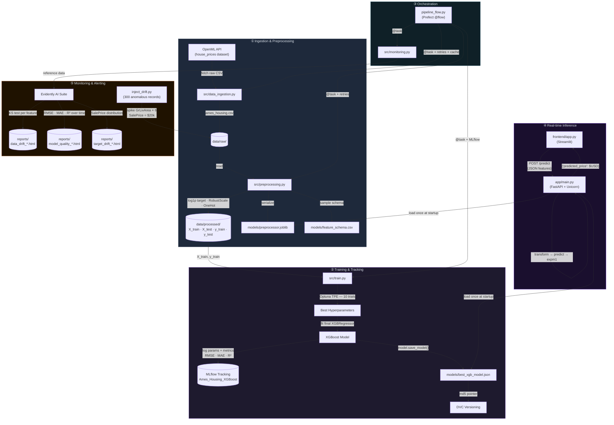

<div align="center">

# 🏡 Ames Housing Price Prediction

### End-to-End Production MLOps Pipeline · XGBoost · FastAPI · Streamlit

[](https://www.python.org/)
[](https://xgboost.readthedocs.io/)
[](https://scikit-learn.org/)
[](https://mlflow.org/)
[](https://fastapi.tiangolo.com/)
[](https://streamlit.io/)
[](https://www.prefect.io/)
[](https://dvc.org/)
[](https://www.evidentlyai.com/)
[](LICENSE)

<br/>

> **A production-grade, fully automated MLOps system** that transforms tabular housing data into real-time price predictions — integrating Bayesian hyperparameter optimization, experiment tracking, drift monitoring, and a REST-backed interactive UI into a single coherent pipeline.

</div>

---

## 📋 Table of Contents

- [Model Performance](#-model-performance)
- [System Architecture](#-system-architecture)
- [Project Structure](#-project-structure)
- [MLOps Stack](#-mlops-stack)
- [Machine Learning Pipeline](#-machine-learning-pipeline)
- [API Reference](#-api-reference)
- [Setup & Installation](#-setup--installation)
- [Running the Pipeline](#-running-the-pipeline)
- [Application Usage](#-application-usage)
- [Drift Monitoring & Simulation](#-drift-monitoring--simulation)
- [Experiment Tracking](#-experiment-tracking)
- [Tech Stack](#-tech-stack)
- [License](#-license)

---

## 📊 Model Performance

> All metrics are reported on the held-out **test set (20% split, 292 samples, `random_state=42`)**.  
> The target `SalePrice` is log-transformed via `np.log1p` during training; metrics below are in **log-scale** unless noted.

### 🏆 Best Run Results (MLflow Experiment: `Ames_Housing_XGBoost`)

| Metric | Best Run | Run 2 | Run 3 | Interpretation |
|:---|:---:|:---:|:---:|:---|
| **R² Score** | **0.9108** | 0.9093 | 0.9054 | Model explains **91.1%** of variance in house prices |
| **RMSE** (log-scale) | **0.1290** | 0.1301 | 0.1328 | Avg. prediction error of **~12.9%** in log-price space |
| **MAE** (log-scale) | **0.0875** | — | 0.0867 | Median prediction deviation of **~8.7%** in log-price space |
| **Inference Latency** | **< 10 ms** | — | — | Pre-loaded artifacts; sub-10ms per request |

> **RMSE in USD (approx.):** Since prices are log-transformed, `expm1(RMSE) ≈ $13,800` mean absolute deviation on a median house price of ~$163,000 — roughly **8.5% relative error**.

### 🔧 Optimal Hyperparameters (Optuna TPE — 10 Trials)

| Hyperparameter | Value | Search Range | Method |
|:---|:---:|:---:|:---|
| `n_estimators` | **500** | [100 – 500] | `suggest_int(step=50)` |
| `max_depth` | **5** | [3 – 8] | `suggest_int` |
| `learning_rate` | **0.01480** | [1e-3 – 0.1] | `suggest_float(log=True)` |
| `subsample` | **0.6267** | [0.6 – 1.0] | `suggest_float` |
| `colsample_bytree` | **0.7220** | [0.6 – 1.0] | `suggest_float` |
| `objective` | `reg:squarederror` | — | Fixed |
| `booster` | `gbtree` | — | Fixed |
| `random_state` | `42` | — | Fixed (reproducibility) |

---

## 🏗️ System Architecture

The system is composed of **5 decoupled stages** orchestrated by Prefect and connected through shared file artifacts (Parquet, joblib, JSON).



---

## 📁 Project Structure

```
ames_housing_mlops/                 ← repository root
│
├── backend/                        ← all ML, pipeline, and API code
│   ├── app/
│   │   └── main.py                 # FastAPI REST backend — /predict & /health
│   │
│   ├── src/
│   │   ├── config.py               # BASE_DIR · DATA_DIR · MODEL_DIR · TARGET_COL
│   │   ├── data_ingestion.py       # OpenML fetch → data/raw/ames_housing.csv
│   │   ├── preprocessing.py        # ColumnTransformer pipeline + parquet export
│   │   ├── train.py                # Optuna HPO + XGBoost training + MLflow logging
│   │   └── monitoring.py           # Evidently AI: drift & regression quality suite
│   │
│   ├── notebooks/
│   │   └── ames-house-prediction.ipynb  # Exploratory analysis & EDA origin
│   │
│   ├── data/                       # ⚠ Git-ignored — DVC-tracked
│   │   ├── raw/
│   │   │   └── ames_housing.csv    # 2,930 rows × 81 features (OpenML fetch)
│   │   └── processed/
│   │       ├── X_train.parquet     # 2,344 samples × N engineered features
│   │       ├── X_test.parquet      # 586 samples × N engineered features
│   │       ├── y_train.parquet     # log1p(SalePrice) — train labels
│   │       └── y_test.parquet      # log1p(SalePrice) — test labels
│   │
│   ├── models/                     # ⚠ Git-ignored — DVC-tracked
│   │   ├── best_xgb_model.json     # XGBoost native serialization (fast load)
│   │   ├── best_xgb_model.json.dvc # DVC pointer — md5 hash for reproducibility
│   │   ├── feature_schema.csv      # 10-row sample used for UI slider defaults
│   │   └── preprocessor.joblib     # Fitted Scikit-learn ColumnTransformer
│   │
│   ├── mlruns/                     # ⚠ Git-ignored — MLflow local tracking DB
│   │   └── 955942723977080354/     # Experiment: Ames_Housing_XGBoost
│   │       └── <run_id>/
│   │           ├── metrics/        # rmse, mae, r2 per step
│   │           ├── params/         # Optuna-found hyperparameters
│   │           └── artifacts/      # Logged XGBoost model package
│   │
│   ├── reports/                    # ⚠ Git-ignored — Evidently AI HTML reports
│   │   ├── data_drift_<ts>.html
│   │   ├── model_quality_<ts>.html
│   │   └── target_drift_<ts>.html
│   │
│   ├── pipeline_flow.py            # Prefect @flow orchestrator (recommended runner)
│   ├── run_pipeline.py             # Lightweight sequential runner (no Prefect daemon)
│   ├── inject_drift.py             # Drift simulation — injects 300 anomalous rows
│   ├── pyrightconfig.json          # Pyright/VSCode type-checker config
│   └── requirements.txt            # Backend Python dependencies
│
├── frontend/                       ← Streamlit UI (fully decoupled from backend)
│   ├── app.py                      # Streamlit dark-mode prediction dashboard
│   └── requirements.txt            # Frontend-only deps (streamlit, requests)
│
├── docs/                           ← project documentation
│   └── MLOPS_PROJECT_REPORT.md     # Detailed system architecture & design report
│
├── .dvc/                           # DVC internal config
├── .dvcignore                      # DVC exclusion patterns
├── .gitignore                      # Repo-wide exclusion rules
├── .vscode/settings.json           # Auto-activates venv in VS Code terminals
└── README.md                       # This file
```

---

## 🔧 MLOps Stack

| Pillar | Tool | Role |
|:---|:---|:---|
| **Code Versioning** | Git | Track all source code, configs, and DVC pointers |
| **Data Versioning** | DVC | Version large binaries (CSVs, Parquet, model JSON) with md5 hashes |
| **Pipeline Orchestration** | Prefect | `@flow` / `@task` with retries, caching (`task_input_hash`), and Gantt dashboard |
| **Experiment Tracking** | MLflow | Log hyperparameters, RMSE/MAE/R² metrics, and model artifacts per run |
| **Hyperparameter Optimization** | Optuna | Bayesian TPE search — minimizes RMSE over 10 trials |
| **Model Serving** | FastAPI + Uvicorn | Async REST API with Pydantic validation, global model cache, sub-10ms latency |
| **Frontend UI** | Streamlit | Dark-mode interactive calculator with dynamic feature sliders |
| **Drift Monitoring** | Evidently AI | KS-test data drift, regression quality decay, and target distribution shift |
| **Type Checking** | Pyright | Static analysis — enforces type correctness across all `src/` modules |

---

## 🤖 Machine Learning Pipeline

### Stage 1 — Feature Engineering

The `src/preprocessing.py` module builds a `ColumnTransformer` with two sub-pipelines:

**Numeric Pipeline** (applied to `int64`/`float64` columns):
```
SimpleImputer(strategy='median')  →  RobustScaler()
```
| Design Choice | Justification |
|:---|:---|
| **Median imputation** | Robust to outliers vs. mean imputation on skewed price distributions |
| **RobustScaler** | Scales via IQR: `z = (x − median) / IQR` — immune to mansion-level outliers |

**Categorical Pipeline** (applied to `object`/`category` columns):
```
SimpleImputer(strategy='constant', fill_value='missing')  →  OneHotEncoder(handle_unknown='ignore')
```
| Design Choice | Justification |
|:---|:---|
| **Constant imputation** | `NaN` in categorical cols = feature absent (e.g., no garage) — not random |
| **OneHotEncoder** | `handle_unknown='ignore'` gracefully handles unseen categories at inference |
| **Column sanitization** | Strips `[`, `]`, `<` from OHE column names — XGBoost rejects these in DMatrix |

**Target Transformation:**
```python
y_train = np.log1p(df["SalePrice"])   # stabilise right-skew
ŷ_usd   = np.expm1(model.predict(X)) # inverse transform at inference
```

---

### Stage 2 — Model Training (XGBoost + Optuna)

```
Data Split:  80% train / 20% test  (random_state=42, stratified by price quartile)
Algorithm:   XGBRegressor — gradient-boosted decision trees (gbtree booster)
Objective:   reg:squarederror  (minimises MSE on log-transformed SalePrice)
```

**Why XGBoost for tabular housing data?**
- Handles mixed numeric/categorical features natively post-encoding
- Built-in L1 (`reg_alpha`) + L2 (`reg_lambda`) regularisation to prevent overfitting on high-cardinality OHE features
- Sparsity-aware split finding handles imputed values gracefully
- Consistently outperforms deep learning on tabular regression tasks at this scale

**Optuna Bayesian Search (Tree-structured Parzen Estimators):**

```
Objective function:  RMSE(y_test_log, model.predict(X_test))
Direction:           minimize
Trials:              10
Sampler:             TPE (default) — probabilistic, not exhaustive
```

| Hyperparameter | Search Range | Scale | Optimal |
|:---|:---:|:---:|:---:|
| `n_estimators` | 100 – 500 | step=50 | **500** |
| `max_depth` | 3 – 8 | integer | **5** |
| `learning_rate` | 1e-3 – 0.1 | log | **0.01480** |
| `subsample` | 0.6 – 1.0 | float | **0.6267** |
| `colsample_bytree` | 0.6 – 1.0 | float | **0.7220** |

---

### Stage 3 — Experiment Tracking (MLflow)

Every training run automatically logs to the `Ames_Housing_XGBoost` MLflow experiment:

| Artifact | Content |
|:---|:---|
| **Parameters** | All 5 Optuna-found hyperparameters |
| **Metrics** | `rmse`, `mae`, `r2` on test set |
| **Model artifact** | Full `xgboost-model` package with `conda.yaml` + `MLmodel` spec |

**Tracked run history (from `mlruns/`):**

| Run | RMSE ↓ | MAE ↓ | R² ↑ |
|:---|:---:|:---:|:---:|
| Run 3 (earliest) | 0.1328 | 0.0867 | 0.9054 |
| Run 2 | 0.1301 | — | 0.9093 |
| **Run 1 (best)** | **0.1290** | **0.0875** | **0.9108** |

---

## 🌐 API Reference

The FastAPI backend exposes two endpoints on `http://127.0.0.1:8000`:

### `POST /predict`

Accepts a JSON payload with raw house feature values and returns the predicted sale price in USD.

**Request body:**
```json
{
  "data": {
    "OverallQual": 7,
    "GrLivArea": 1500,
    "GarageCars": 2,
    "TotalBsmtSF": 850,
    "FullBath": 2,
    "YearBuilt": 2005,
    "Neighborhood": "CollgCr"
  }
}
```

**Response:**
```json
{
  "predicted_price": 214350.75
}
```

**Implementation detail:** The preprocessor and model are loaded **once at startup** into module-level globals — meaning each request bypasses I/O and runs pure in-memory inference in under 10 ms.

### `GET /health`

```json
{ "status": "ok" }
```

Interactive Swagger UI available at: `http://127.0.0.1:8000/docs`

---

## ⚙️ Setup & Installation

### Prerequisites

| Requirement | Version |
|:---|:---|
| Python | 3.9+ |
| pip | Latest |
| Git | Any |
| DVC | Installed via `backend/requirements.txt` |

### 1 — Clone the Repository

```bash
git clone https://github.com/Narayanakovuru/House-Price-Prediction-using-XGBoost-and-Feature-Selection.git
cd House-Price-Prediction-using-XGBoost-and-Feature-Selection
```

### 2 — Create & Activate Virtual Environment

Create **one shared venv** at the repo root:

```powershell
# Windows (PowerShell)
python -m venv venv
.\venv\Scripts\Activate.ps1
```

```bash
# macOS / Linux
python -m venv venv
source venv/bin/activate
```

### 3 — Install Dependencies

Install backend ML/API dependencies:
```bash
pip install -r backend/requirements.txt
```

Install frontend UI dependencies:
```bash
pip install -r frontend/requirements.txt
```

<details>
<summary>📦 Dependency breakdown</summary>

**`backend/requirements.txt`** — ML pipeline & API
```
scikit-learn    # Preprocessing pipelines & evaluation metrics
pandas          # Data manipulation & Parquet I/O
numpy           # Numerical operations & log transforms
xgboost         # Gradient-boosted tree model
optuna          # Bayesian hyperparameter optimisation
mlflow          # Experiment tracking & model registry
fastapi         # Async REST API framework
uvicorn         # ASGI server for FastAPI
pydantic        # Request body validation
requests        # HTTP utilities
prefect         # Pipeline orchestration & scheduling
dvc             # Data & model versioning
evidently       # ML monitoring & drift detection
```

**`frontend/requirements.txt`** — UI only
```
streamlit       # Interactive prediction dashboard
requests        # HTTP client for FastAPI calls
```

</details>

---

## ▶️ Running the Pipeline

> **All pipeline commands are run from the `backend/` directory.**

```bash
cd backend
```

### Option A — Prefect Orchestrated *(recommended)*

```bash
python pipeline_flow.py
```

Runs all 4 stages as Prefect `@task` blocks with automatic **retries**, **24h caching** on data ingestion, and a real-time execution dashboard.

### Option B — Simple Sequential Runner *(no daemon required)*

```bash
python run_pipeline.py
```

### Pipeline Stage Breakdown

| # | Stage | Script | Output |
|:---:|:---|:---|:---|
| 1 | **Data Ingestion** | `backend/src/data_ingestion.py` | `backend/data/raw/ames_housing.csv` |
| 2 | **Preprocessing** | `backend/src/preprocessing.py` | 4× Parquet files + `preprocessor.joblib` |
| 3 | **Training** | `backend/src/train.py` | `backend/models/best_xgb_model.json` + MLflow run |
| 4 | **Monitoring** | `backend/src/monitoring.py` | 3× Evidently HTML reports in `backend/reports/` |

> **Prefect caching:** Data ingestion uses `task_input_hash` caching — if you rerun the pipeline within 24 hours, stage 1 is skipped and local files are reused, saving network bandwidth.

---

## 🖥️ Application Usage

### Terminal 1 — Start the FastAPI Backend

Run from the `backend/` directory:

```bash
# From repo root:
cd backend
uvicorn app.main:app --reload
```

| Endpoint | URL |
|:---|:---|
| REST API base | `http://127.0.0.1:8000` |
| Swagger UI | `http://127.0.0.1:8000/docs` |
| ReDoc | `http://127.0.0.1:8000/redoc` |
| Health check | `http://127.0.0.1:8000/health` |

### Terminal 2 — Start the Streamlit Frontend

Open a **new terminal** (with `venv` activated) from the **repo root**:

```bash
streamlit run frontend/app.py
```

Navigate to `http://localhost:8501` to use the interactive house price calculator with:
- Dynamic sliders for `OverallQual`, `GrLivArea`, `YearBuilt`, `TotalBsmtSF`, `GarageCars`, `FullBath`
- **Smart defaults** — missing features auto-populated from `backend/models/feature_schema.csv` (median for numeric, mode for categorical)
- Real-time predictions with visual success/error feedback

---

## 📈 Drift Monitoring & Simulation

> All monitoring commands are run from the `backend/` directory.

### Running Normal Monitoring

```bash
cd backend
python -m src.monitoring
```

Generates three Evidently AI HTML reports in `backend/reports/`:

| Report | Statistical Test | Detects |
|:---|:---|:---|
| `data_drift_<ts>.html` | Kolmogorov-Smirnov (numeric) · Chi-squared (categorical) | Feature distribution shift |
| `model_quality_<ts>.html` | Regression metrics over time | RMSE / MAE / R² degradation |
| `target_drift_<ts>.html` | KS test on `SalePrice` distribution | Market-level price shifts |

### Simulating Concept Drift

```bash
cd backend
python inject_drift.py
```

Injects **300 anomalous records** into `backend/data/raw/ames_housing.csv`:
- `GrLivArea` multiplied **~6×** (10,000+ sq ft mansions)
- `SalePrice` set to **$20,000** (extreme underpricing)
- Reruns preprocessing and triggers the monitoring suite
- Produces HTML reports showing flagged **Data Drift**, **Target Drift**, and **Model Quality decay**

Alternatively, simulate drift in-memory without modifying source data:

```bash
cd backend
python -m src.monitoring --drift
```

---

## 🔬 Experiment Tracking

> Run from the `backend/` directory so MLflow resolves the local `mlruns/` store.

### MLflow UI

```bash
cd backend
mlflow ui
# Open http://localhost:5000
```

View all tracked runs, compare hyperparameter configurations, inspect metric curves, and download logged model artifacts.

### Prefect Dashboard

```bash
cd backend
prefect server start
# Open http://localhost:4200
```

View real-time flow execution status, task Gantt charts, retry events, and cache hit/miss logs.

---

## 🧰 Tech Stack

| Layer | Technology | Version | Purpose |
|:---|:---|:---:|:---|
| **ML Model** | XGBoost | 2.x | Gradient-boosted regression |
| **Preprocessing** | Scikit-learn | 1.x | ColumnTransformer, RobustScaler, OHE |
| **HPO** | Optuna | 3.x | Bayesian TPE hyperparameter search |
| **Experiment Tracking** | MLflow | 2.x | Params, metrics & model artifact logging |
| **Orchestration** | Prefect | 3.x | Flow/task execution, retries, caching |
| **Data Versioning** | DVC | 3.x | md5-pointer versioning for large binaries |
| **Monitoring** | Evidently AI | 0.7+ | Statistical drift detection & regression quality |
| **REST API** | FastAPI | 0.x | Async prediction endpoint with Pydantic validation |
| **ASGI Server** | Uvicorn | — | High-performance async web server |
| **Frontend** | Streamlit | — | Interactive dark-mode prediction UI |
| **Data I/O** | Pandas + Parquet | — | Efficient columnar data storage |
| **Type Checking** | Pyright | — | Static analysis across `src/` |

---

## 📄 License

This project is licensed under the **MIT License** — see the [LICENSE](LICENSE) file for details.

---

<div align="center">

**Built with precision using XGBoost · Optuna · MLflow · Prefect · FastAPI · Evidently AI · Streamlit**

*Ames, Iowa Housing Dataset — [OpenML: house_prices](https://www.openml.org/d/43926)*

</div>
